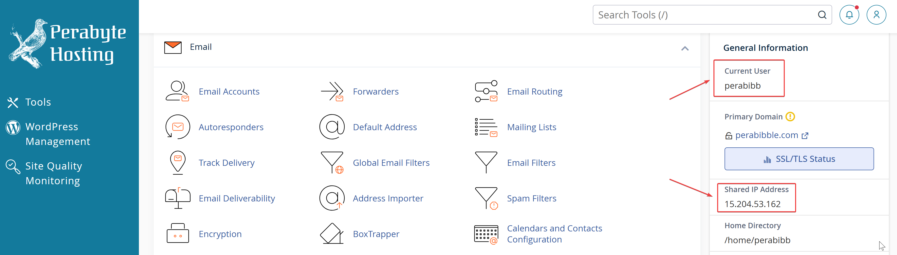
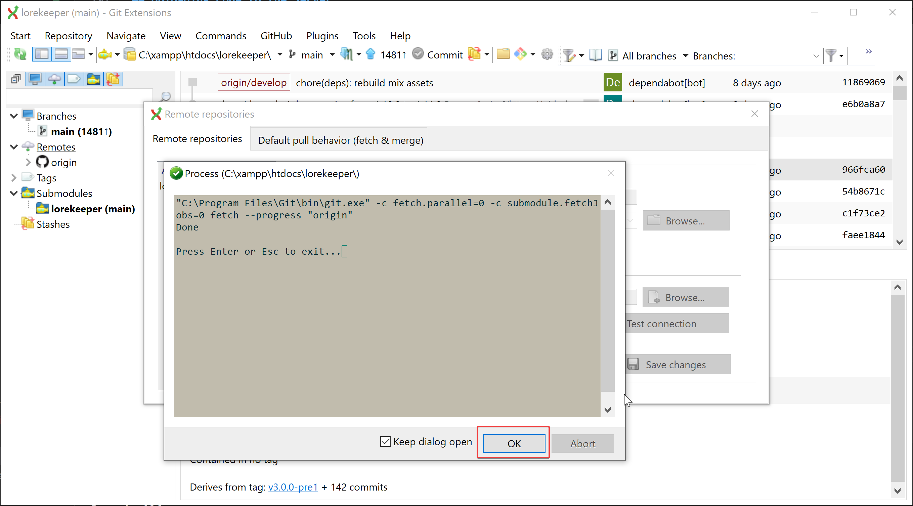
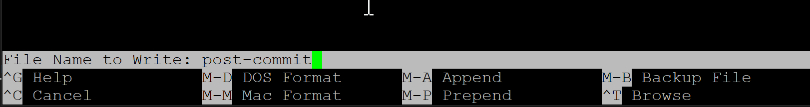
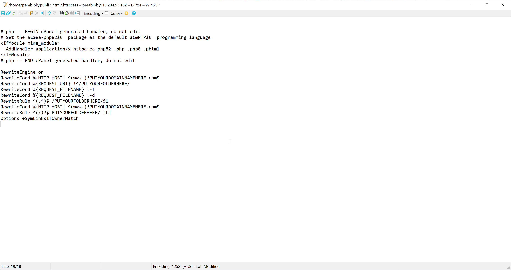

## Introduction
This is a guide on how to setup your Lorekeeper hosting on my Dreamhost alternative, [Perabyte](https://perabyte.dev). While I hesitate to make this setup guide an advertisement for my own service, it has some notable advantages over Dreamhost. Part of the setup is already completed for you, it is more stable than DH/cheaper in the long run, and other benefits.

If you prefer Dreamhost, some of this tutorial will still apply, although it will require some extra steps. These are detailed in some older guides for Lorekeeper.

**This second part walks you through setting up your local copy of Lorekeeper. If you have NOT set up your local, click [here](/posts/lorekeeper-setup-part-1) for part one.**

## Before You Start
- **This guide assumes you have a local copy of Lorekeeper already installed and functional.** This is REQUIRED before progressing further.
- **This guide assumes you are on Windows.** Linux and Mac have alternatives to XAMPP and different methods for SSH. Please reach out to the Lorekeeper Discord if you're on one of those operating systems.
- **Please read every step of this guide carefully,** especially because this section involves real life money. I highly recommend doing a full read-through before you even get started.

## Buying Hosting Services

1. Go to the website [here](https://perabyte.dev/billing/index.php). In the top dropdown, click "Store" and then "Browse All".

[](/content/img/perabyte-setup/buying-hosting.png){data-fslightbox data-type="image"}

2. Click "Order Now" under "Laravel Hosting".

[](/content/img/perabyte-setup/buying-hosting-1.png){data-fslightbox data-type="image"}

3. Here you have three options for your domain name.

 - You can buy it through Perabyte, which is convenient but a dollar or two more expensive.
 - You can buy it through a third party like [Namecheap](https://www.namecheap.com) (the registrar I recommend), which is less convenient but potentially cheaper. Namecheap's domains also come with privacy protection, which I'm unable to provide.

  For the sake of this example, I will be buying a new domain. I will include a section later on the page on how to buy a domain through Namecheap and configure it.

  [](/content/img/perabyte-setup/buying-hosting-2.png){data-fslightbox data-type="image"}

4. Next, you'll be taken to this page. **Enter in any information about your plans for the website, as well as your contact     information.** This is just to make sure you're a real person! Don't stress it too hard -- anything'll do. Take this as an opportunity to talk about your species if you want! 

    After that, click "Continue".

  [](/content/img/perabyte-setup/buying-hosting-3.png){data-fslightbox data-type="image"}

5. You'll then have the opportunity to review your cart. **Billing is done pro-rata, which means that you paying for the remainder of the *current* month and then the month after, so that billing starts on the 1st of the month.** If everything looks good, click "Checkout".

[](/content/img/perabyte-setup/buying-hosting-4.png){data-fslightbox data-type="image"}

6. After that, progress through the checkout screens! __Please keep in mind what address you enter if buying a domain name. Don't doxx yourself!__ When you're doing, you should be presented with a screen like this:

[](/content/img/perabyte-setup/buying-hosting-5.png){data-fslightbox data-type="image"}

7. Verify your email! **After this, wait a few hours for your order to be processed.** If it's during business hours it should be right away, otherwise, it'll be processed sometime between 9 AM and 7 PM CST.

8. You should receive an email after your account is made active. When completed, go back to the Client Area and you'll see your website! Click the "Login to cPanel" button.

[](/content/img/perabyte-setup/buying-hosting-6.png){data-fslightbox data-type="image"}

9. **If presented with this screen, click "Skip".**

[](/content/img/perabyte-setup/buying-hosting-7.png){data-fslightbox data-type="image"}

10. Congratulations! You now have everything you need to start setting up your Lorekeeper.

## Optional: Configuring Your Domain Name

If you bought your domain name through something like Namecheap, you'll have a little bit of configuring to do first. 

1. In cPanel, scroll down to "Domains" and click "Zone Editor".

[](/content/img/perabyte-setup/domain-config-1.png){data-fslightbox data-type="image"}

2. Next to your domain, click "Manage". It will bring you to a page with a lot of records. You don't need to worry about any of them! The values we care about are the nameservers, highlighted in red:

[](/content/img/perabyte-setup/domain-config-2.png){data-fslightbox data-type="image"}

3. After purchasing your domain on Namecheap (or elsewhere), you'll be brought to a page like this. What you want to do is replace the nameservers for your domain with the ones on Perabyte. On Namecheap, it can be found here:

[](/content/img/perabyte-setup/domain-config-3.png){data-fslightbox data-type="image"}

4. Replace those with the nameservers provided on Perabyte, and save. That should be all the configuration you need!

[](/content/img/perabyte-setup/domain-config-4.png){data-fslightbox data-type="image"}

## Setting Up SSH

1. It's time to download some new software! Go [here](https://www.chiark.greenend.org.uk/~sgtatham/putty/latest.html) to download PuTTY. Click the highlighted link to download it -- you want the "64-bit x86" version.

[](/content/img/perabyte-setup/setting-up-ssh.png){data-fslightbox data-type="image"}

2. We're going to click through the screens to install PuTTY. Click "Next", leaving all settings as default, until you reach the "Install" button.

[](/content/img/perabyte-setup/setting-up-ssh-1.png){data-fslightbox data-type="image"}

3. After that's done, feel free to uncheck the README, and click "Finish".

[](/content/img/perabyte-setup/setting-up-ssh-2.png){data-fslightbox data-type="image"}

4. When you installed PuTTY, it also installs a software called PuTTYgen. Open up this software.

[](/content/img/perabyte-setup/setting-up-ssh-3.png){data-fslightbox data-type="image"}

5. It should look like this when opened. We are going to press the "Generate" button.

[](/content/img/perabyte-setup/setting-up-ssh-4.png){data-fslightbox data-type="image"}

6. Now wiggle your mouse around as instructed!

[](/content/img/perabyte-setup/setting-up-ssh-5.png){data-fslightbox data-type="image"}

7. Now, save both your Public and Private key to somewhere safe on your computer. **I am showing the key in this image for example's sake, but do not share this key publicly!** It's better to have people set up their own keys than to share yours.

[](/content/img/perabyte-setup/setting-up-ssh-6.png){data-fslightbox data-type="image"}

4. **DON'T close PuTTYGen.** We're going to go back to cPanel now. Scroll down to "Security" and click "SSH Access".

[](/content/img/perabyte-setup/setting-up-ssh-7.png){data-fslightbox data-type="image"}

5. Click "Manage SSH Keys".

[](/content/img/perabyte-setup/setting-up-ssh-8.png){data-fslightbox data-type="image"}

6. Then, click "Import Key".

[](/content/img/perabyte-setup/setting-up-ssh-9.png){data-fslightbox data-type="image"}

7. In PuTTYGen, we are going to copy all of the text labeled "Public key for pasting into authorized_keys file".

[](/content/img/perabyte-setup/setting-up-ssh-10.png){data-fslightbox data-type="image"}

8. Paste this text into the "Public Key" section in cPanel, and give it a name. Click "Save".

[](/content/img/perabyte-setup/setting-up-ssh-11.png){data-fslightbox data-type="image"}

9. Nice! Click to go back to "Manage Keys".

[](/content/img/perabyte-setup/setting-up-ssh-12.png){data-fslightbox data-type="image"}

10. Next to the key you've just imported, click "Manage".

[](/content/img/perabyte-setup/setting-up-ssh-13.png){data-fslightbox data-type="image"}

11. Click "Authorize".

[](/content/img/perabyte-setup/setting-up-ssh-12.png){data-fslightbox data-type="image"}

[](/content/img/perabyte-setup/setting-up-ssh-12.png){data-fslightbox data-type="image"}

> ***Sidenote:*** If you have multiple people working on your site, you will need to add SSH keys for them using this same method. They can provide you the public key, which you can add in cPanel just like you added yours.
>  
> Password authentication is not available on Perabyte for security purposes -- password authentication is incredibly insecure compared to SSH keys. Just remember -- **NEVER** give out your private key!

12. Great! You can now connect to your server using the SSH key you just generated. We're going to do exactly that. Open up PuTTY.

[](/content/img/perabyte-setup/setting-up-ssh-16.png){data-fslightbox data-type="image"}

13. You'll be presented with something like this:

[](/content/img/perabyte-setup/setting-up-ssh-17.png){data-fslightbox data-type="image"}

14. On the left side, we're going to click SSH -> Auth -> Credentials.

[](/content/img/perabyte-setup/setting-up-ssh-18.png){data-fslightbox data-type="image"}

15. Then you'll be presented with a screen like this. In the "private key file" for authentication section, put the .ppk file that you saved. Leave the rest blank.

[](/content/img/perabyte-setup/setting-up-ssh-19.png){data-fslightbox data-type="image"}

16. Click "Default Settings", then click "Save".

[](/content/img/perabyte-setup/setting-up-ssh-20.png){data-fslightbox data-type="image"}

17. Now we're going to open back up **Git Extensions**, which you might remember from the first part of the tutorial. You will probably see this checklist again:

[](/content/img/perabyte-setup/setting-up-ssh-21.png){data-fslightbox data-type="image"}

18. ...except this works in our favor, because we want to change our settings. If you have the checklist disabled, you can open up your settings by going to Tools -> Settings in the top navbar of the dashboard. Click "SSH" in the sidebar.

[](/content/img/perabyte-setup/setting-up-ssh-22.png){data-fslightbox data-type="image"}

19. We are going to select "PuTTY". These fields should automatically populate. If not, navigate to where you have PuTTY installed and select the relevant .exe files. Then, check the box at the bottom of the page.


> ***Sidenote:*** If you want to prevent the checklist from popping up every time you open the software, you can click "Repair" next to one of the two options here. 
> 
> Next, select "vscode" for both "Mergetool" and "Difftool" (or if you know what you're doing, one of the other options).
> 
> Click "Apply". Now your checklist should be completely green!
> 

18. Back to business! Close your settings by pressing "OK" and you'll be sent to the dashboard. Your lorekeeper directory should be in your history from last time. Open it.


19. In the top navbar, click Tools -> PuTTY -> Start Authentication Agent.


20. You should now notice a little icon in your taskbar that looks like a TV monitor wearing a little hat. Right-click this icon and select "Add Key".


21. Navigate to your .ppk file and select it.


22. Okay, all of our SSH connections are configured! Time to actually copy our code.

## Uploading Code to the Server

### Connecting to the Website

1. We are going to go back to the cPanel dashboard. We want to make note of two things: the Current User, and Shared IP Address.



> ***Sidenote:*** You can also use your domain name instead of the IP address.

2. Now, we're going to go back to PuTTY. In the blank space, you want to put "USERNAME@IPADDRESS". In my example, I put "perabibb@15.204.53.162".


3. If everything works as planned, this is what you should see!


4. **Congratulations!!** You are now connected to your website. Now it's time for some setup!

### Setting up www and site_hub.git

5. Type in the command `ls`. This will display all of the files and folders in our current location. It should look like this:


6. We are going to type in `cd public_html` to change our directory. Run `ls` again. It should look like this:


7. Great! Let's make some directories. The way that this works is that we will send our files to a directory called `site_hub.git`, which will then send them to a directory called `www`. First we are going to make the `www` directory. Run these commands, one by one:

```
mkdir perabibble.com
cd perabibble.com
mkdir www
cd www
git config --global init.defaultBranch main
git init
```

It should look like this when you're done (I've highlighted the commands to make them easier to see):


8. Now we are going to create the `site_hub.git` directory, next to the `www` one. Run these commands:

```
cd ..
mkdir site_hub.git
cd site_hub.git
git --bare init
```

It should look like this when you're done:


9. **Go back to Git Extensions, but do NOT close PuTTY yet!** You should still have your repository open. Right-click "Remotes" on the sidebar, then click "Manage".


10. First, we are going to rename the core Lorekeeper repository location. We want to keep it, because pulling from core is how we will update our website in the future. In the name field, type in "lorekeeper" or something similar, then click "Save Changes".


11. Now, click the "plus" icon to add a new remote.


12. We will call this "origin", and we are adding a special URL here. Change the following to your specific login information:

```
ssh://username@ipaddress/~/public_html/yoursite.com/site_hub.git
```

> **Sitenote:** You can use the domain name instead of the IP address if you have it configured.

In my example, it's `ssh://perabibb@15.204.53.162/~/public_html/perabibble.com/site_hub.git`

We will also load in our same .ppk file from earlier, under "Private key file".

When you've entered in all the information, it should look something like this:


13. Click "Save changes". You may see this option. Click "Yes".


14. Next, you'll see this familiar screen. Go ahead and click "OK" when prompted.



15. Then press the X in the top right to close this window.


16. In the top navbar, click "Commands" and then "Push".


17. In the dropdown, select "origin". Then click "Push"!


18. If you are prompted with this window, that's OK. Click "Yes".


19. It might take a little while to upload (Lorekeeper has a lot of files!). When it's done, click "OK".


20. Now we have to configure some scripts that will tell our server how to handle Lorekeeper's files. Go back to PuTTY -- you should still be in the `site_hub.git` directory. We will type in two commands:

```
cd ../www
git remote add hub ../site_hub.git
```

If it was successful, it'll look like this:


21. Now we will type in `git pull hub main`. This will copy the files from `site_hub.git` into `www`. It should look like this when it's done: 


22. If you type in `ls`, you should see all of the files needed for Lorekeeper!


23. Now we need to configure the **git hooks**. These will automatically sync the code between `site_hub.git` and `www`, so we don't need to do it manually every time.

Type in these two commands:
```
cd .git/hooks
nano post-commit
```

This will bring up this text editor called "nano":


24. Copy all of the following text:

```
#!/bin/sh

echo
echo "**** Pushing changes to Hub [Prime's post-commit hook]"
echo

git push hub
```

Using right-click, paste it into the text editor. It should look like this:


25. Press `ctrl + x`. This will show up at the bottom of the screen. Enter `y`.


26. Then, press `enter`.



27. Enter a command to make the file executable:

```
chmod +x post-commit
```

It should look like this when you're done:


28. We're going to do a similar thing in the `site_hub.git` directory. Enter these two commands:

```
cd ../../../site_hub.git/hooks
nano post-update
```

This will open another blank text editor:


29. Enter in the following text, changing `YOURSITE.com` to the domain name of your site:

```
#!/bin/sh

echo
echo "**** Pulling changes into Prime [Hub's post-update hook]"
echo

cd $HOME/public_html/YOURSITE.com/www || exit
unset GIT_DIR
git pull hub main

exec git-update-server-info
```

Just like before, it'll look something like this:


30. Press `ctrl + x`, type `y`, and then `enter` like before to save and close the file.

It should look like this when you're done:


31. We will also make that file executable with `chmod +x post-update`:


### Installing Composer

1. On Perabyte, Composer is already installed for you. From where we just left off, type in `cd ../../www`. This will bring us back to the `www` directory.

2. Type in `composer install`. A lot of text should fly by, and it will look like this when complete:


3. If you receive any errors when running `composer install`, please send a ticket!

### Changing Your Document Root

1. We now need to tell the server where our Lorekeeper files are located. We will be downloading the software WinSCP as our FTP software. Click [here](https://winscp.net/eng/download.php) to download WinSCP.

2. Run the file. Click "Accept" to accept the license.


3. Make sure "Full upgrade" or "Full install" is selected.


4. Click "Install".


5. After it finishes installing, check "Launch WinSCP" and uncheck "Open Getting Started" (unless you want to). Then click "Finish".


6. A login screen should automatically open up. I already have a lot of sites loaded into my copy of WinSCP, but yours will probably be empty. Click "New Site" on the left hand sidebar.


7. Type in the IP address and username you use to log into the site, then click "Advanced".


8. Click SSH -> Authentication in the sidebar, then once again load in your .ppk file.


9. Click "OK" to save and close that window.

10. Click "Save". The defaults are fine. Click "OK".


11. Now, click "Login"!


12. A loading window should pop up as WinSCP logs you in. After that automatically closes, you'll be presented with something like this:


13. We are interested in the `public_html` folder. Double-click that folder to open it.


14. You will see a file labeled `.htaccess`. Click it, then click the "Edit" button.


15. A text editor will open with contents similar to this:



16. We are going to replace some of those values. Each `PUTYOURDOMAINNAMEHERE.com` should be replaced with your URL, and `PUTYOURFOLDERHERE` should be replaced with `yourdomain.com/www/public`. Don't change anything else in this file!

For example, this is mine:


For easily copyable reference:

```
RewriteEngine on
RewriteCond %{HTTPS} !=on
RewriteRule ^(.*)$ https://%{HTTP_HOST}%{REQUEST_URI} [L,R=301,NE]
RewriteCond %{HTTP_HOST} ^(www.)?PUTYOURDOMAINNAMEHERE.com$
RewriteCond %{REQUEST_URI} !^/PUTYOURFOLDERHERE/
RewriteCond %{REQUEST_FILENAME} !-f
RewriteCond %{REQUEST_FILENAME} !-d
RewriteRule ^(.*)$ /PUTYOURFOLDERHERE/$1
RewriteCond %{HTTP_HOST} ^(www.)?PUTYOURDOMAINNAMEHERE.com$
RewriteRule ^(/)?$ PUTYOURFOLDERHERE/ [L]
Options +SymLinksIfOwnerMatch
```

17. Save this file by clicking the icon in the top right corner. Then close it by clicking the "X".


18. Apache now knows how to serve our files.

## Services Setup

Now we're going to set up some services required for our site to run.

### Creating the Database

1. Now we're going to go back to cPanel. Scroll down to "Databases" and click "Manage My Database".


2. Under "Create New Database", enter in any name that makes sense and then click "Create Database".


You should see a success message. Click "Go Back".


3. If you see a warning here, that's OK, just ignore it. Scroll down to "Add New User". Enter in a name and password you can remember, then click "Create User".


4. Finally, scroll down to "Add User to Database" and click "Add".


5. Check "All Privileges" and then "Make Changes".


4. And that's it for the database! Click back to "Tools" on the left.

### Creating Email Account

1. Perabyte provides an email account for free. To create it, click "Email Accounts" under "Email".


2. Click the "Create" button.


3. Enter a username and password for the email, then click "Create". Keep this information for your records! We'll need it later. You can leave everything else as default.


4. You'll be sent back to this screen. Click "Connect Devices" next to your newly created email account.


5. Most of this isn't relevant to us, so you can continue to scroll down to "Mail Client Manual Settings". You want the "Outgoing Server" SMTP information.


6. Copy the username and outgoing server information. We'll need this later!

### Setting Up Third Party Authentication.

This one is a bit of a choose-your-own-adventure. Historically, Lorekeeper required any new user to authenticate with a third party application (usually deviantArt or Toyhouse) in order to verify their account. LK v3.0.0 allows you to turn this feature off if you want, but it's recommended to keep it on.

You can find up-to-date guides for how to setup Toyhouse, deviantArt, Discord, and other authentication methods in the Lorekeeper documentation [here](https://lk-arpg.github.io/lk-docs/latest/guides/socmed/).

## Setting Up The Website

The home stretch! We are now going to create an environment (.env) file that stores our Lorekeeper configuration.

1. Go back to WinSCP and navigate to your `www` directory. For me, that is `/home/perabibb/public_html/perabibble.com/www`.

2. Right click anywhere in the blank space and click New -> File.


3. Name this file `.env` exactly, and click "OK".


4. This will open up another text editor. We are going to paste many lines into this file:

First, we will paste this block.
```
APP_NAME=SiteName
APP_ENV=production
APP_KEY=
APP_DEBUG=false
APP_URL=http://yourdomain.com
```
- Do not include any spaces in the value for APP_NAME
- Make sure APP_DEBUG is set to `false`!
- Set the value of APP_URL to your site's domain name

```
CONTACT_ADDRESS=youremail@domain.com
DEVIANTART_ACCOUNT=daaccount

LOG_CHANNEL=stack
```
- CONTACT_ADDRESS can be whatever email you're comfortable being public.
- DEVIANTART_ACCOUNT can be left blank if you do not have a dA account for the ARPG/species.

```
DB_CONNECTION=mysql
DB_HOST=127.0.0.1
DB_PORT=3306
DB_DATABASE=databasename
DB_USERNAME=databaseusername
DB_PASSWORD=databasepassword
```
- Change `databasename` to the database you created earlier. Ours is `perabibb_lorekeeper`.
- Change `databaseusername` to the database user your created earlier. Ours is `perabibb_dbuser`.
- Change `databasepassword` to the password for the user you created earlier.

```
BROADCAST_DRIVER=log
CACHE_DRIVER=file
QUEUE_CONNECTION=sync
SESSION_DRIVER=file
SESSION_LIFETIME=120

REDIS_HOST=127.0.0.1
REDIS_PASSWORD=null
REDIS_PORT=6379
```
- This info is generic and can be left as-is.

```
MAIL_DRIVER=smtp
MAIL_HOST=manage.perabyte.host
MAIL_PORT=465
MAIL_USERNAME=emailusername
MAIL_PASSWORD=emailpassword
MAIL_FROM_ADDRESS=emailfromaddress
MAIL_FROM_NAME="name"
```
- Change `emailusername` to the email username you recorded earlier. Ours is `noreply@perabibble.com`.
- Change `emailpassword` to the email password your recorded earlier.
- Change `emailfromaddress` to the same as the username.
- Change `name` to whatever you'd like to show to users when they receive email from you. Typically this would be your species or ARPG name.

```
AWS_ACCESS_KEY_ID=
AWS_SECRET_ACCESS_KEY=
AWS_DEFAULT_REGION=
AWS_BUCKET=

PUSHER_APP_ID=
PUSHER_APP_KEY=
PUSHER_APP_SECRET=
PUSHER_APP_CLUSTER=

MIX_PUSHER_APP_KEY="${PUSHER_APP_KEY}"
MIX_PUSHER_APP_CLUSTER="${PUSHER_APP_CLUSTER}"
```
- This information is also generic and can be left blank.

**At the end, add any social media authentication methods you have created.** For example, for deviantArt, mine might be:
```
DEVIANTART_CLIENT_ID=1234567890
DEVIANTART_CLIENT_SECRET=agsdbhjhjfjksjs
DEVIANTART_CALLBACK_URL=/
```

When done, the file will look something like this:


5. Save and close this file.

6. Go back to PuTTY. You should still be in your `www` directory, or navigate to it using `cd`. 

7. Type in `php artisan key:generate`. If your .env file is configure successfully, it should look like this:


### Running Setup Commands

1. Home stretch! First, we'll set up our database with `php artisan migrate`. This will cause a LOT of text to fly by. It should look like this when complete:


2. Next, we need to add the site settings. Type in `php artisan add-site-settings`. You may remember these from setting up your local:


3. Then we will add the default text pages with `php artisan add-text-pages`:


4. Copy the default images with `php artisan copy-default-images`:


5. Finally, we'll set up the admin account with `php artisan setup-admin-user`. **I highly recommend you do NOT make this your personal account. Make it something like "admin".** You will remember something similar to when you set up your local. Please make sure these credentials are secure, but if you ever forget them, you can re-run the command to reset the password:


### Configuring Cron Jobs

1. Cron Jobs perform actions such as queueing up news posts, resetting dailies, etc. Go back to cPanel and scroll down to "Advanced", then click "Cron Jobs".


2. Scroll down to "Add New Cron Job". From the dropdown, select "Once Per Minute". Don't add an email address unless you really like spam.

In the "Command" box, type in the following, replacing `yourdomain.com` with your site's domain name: 

```
cd ~/public_html/yourdomain.com/www && /usr/local/bin/ea-php82 artisan schedule:run >> /dev/null 2>&1 
```


### Configuring SSL

1. Most of the time, SSL should be automatic. However, sometimes it will default to a self-signed certificate, which may show like this in your browser:


2. To fix this, we can manually run the AutoSSL service. Click the big "SSL/TLS Status" button on the left-hand side:


3. Click "Run AutoSSL".


4. Give it 10-15 minutes to complete. If you are still having issues, feel free to send a ticket.

## Congratulations!

Your site should now be live and active at your domain name.


Click here for part 3 on how to utilize Lorekeeper's basic features, edit settings, and install extensions.